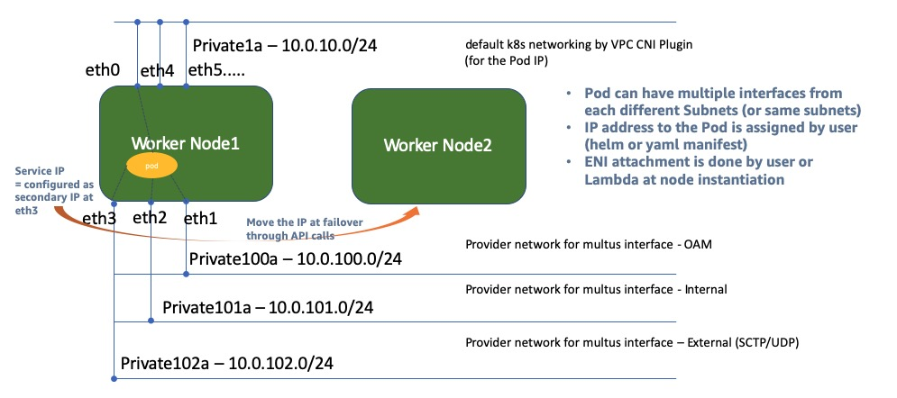

## Self-managed Workernode Group with Multiple-subnet Interfaces 
**(a.k.a. Multus CNI Plugin with EKS/VPC CNI Plugin)**

This is the CloudFormation template for self-managed worker node creation with Multus CNI plugin in EKS. In case of Telecom network function implementation on AWS EKS environment, multus meta-CNI plugin is frequently being requested to make Pod to have multi-homed interfaces(https://github.com/intel/multus-cni). In AWS environment, to use this multus CNI plugin along with VPC CNI plugin, workernode group has to attach multiple interfaces with making those interfaces not to be managed by VPC CNI plugin. This CloudFormation template for self-managed worker node group is to create workernode instances for EKS with having secondary interfaces without being managed by VPC CNI Plugin. As a result of CFN, workernode will spin off with having 1st interface to be VPC CNI controlled default K8s networking and 2nd (3rd, 4th as defined) interface to be for multus interfaces. (If VPC CNI requires more ENIs for assigning Pod IP address, then it attaches more ENIs after multus interfaces in order). 


## Security

See [CONTRIBUTING](CONTRIBUTING.md#security-issue-notifications) for more information.

## License

This library is licensed under the MIT-0 License. See the LICENSE file.

## Pre-requisites
- This CFN assumes user already has created VPC, security groups and subnets (even for subnets of multus interfaces). 
- Current Lambda supports maximum 4 additional multus subnets (besides with a default K8s network). But user can modify to increase the number of multus interfaces. 
- **[Important Note]** User must be aware of and responsible of that using this CFN and this mode of multus will cause the number of pods hosted on the workernode to be reduced down because this mode is dedicating certain number of ENIs only for Multus subnet purpose. 
(In general, a number of max Pods on the node has tight dependancy to the number of ENIs available for VPC CNI plugin.)

## Behind the scene
From the baseline CFN for self-managed node group, below functions are added;
- LifeCycle Hook creation for the self-managed workernode ASG.
- Lambda function creation for multus ENI attachment of 2ndary subnet (using the code (in zip file) pre-uploaded in S3). The lambda function supports multus subnets as many as defined in the CFN template with MultusSubnet1, MultusSubnet2,... (as well as MultusSecurityGroup1, MultusSecurityGroup2...). While attaching multus interfaces to the instance, also it adds "no_manage" tag to these interfaces so that these would not be controlled by VPC CNI Plugin. 
    - Number of additional Multus ENIs can be limited by the size of instance. (please refer to https://docs.aws.amazon.com/AWSEC2/latest/UserGuide/using-eni.html for more detail).
- CloudWatch Event Rule to trigger Lambda function. 
- Automatic-reboot after the first creation of instance (only after the first creation of Autoscaling group), to kick in life-cycle hook to invoke Lambda for multus interface attachment. 

## Usage 
- Install the **multus meta-cni plugin** in your EKS.
    ```
    git clone https://github.com/intel/multus-cni.git
    kubectl apply -f ~/multus-cni/images/multus-daemonset-pre.yml
    ```
- Before running this CloudFormation, you have to place lambda_function.zip file (compress lambda_function.py in lambda folder) to your S3 bucket.
- During CFN stack creation
    - Select primary private subnet for the parameter of `Subets` where the primary K8s networking interface would be connected to. 
    - Select 2ndary (Multus) subnet for the parameter of `MultusSubnet1/2/3/4..` where multus ENIs will be connected to.
- After completion of stack creation, update aws-auth-cn.yaml with Node Role ARN in Output section of the CloudFormation result, to make workernodes to join the your EKS cluster. 
- Once all workernodes come up with multiple ENIs as intended (please make it sure each multus subnet ENI has to be with "no_manage" tag) and also workernodes successfully join to your EKS cluster, then you can deploy an application that is with multus-cni network definition in following steps. 
    - NetworkAttachmentDefinition [example].
    ```
    apiVersion: "k8s.cni.cncf.io/v1"
    kind: NetworkAttachmentDefinition
    metadata:
      name: ipvlan-conf
    spec:
      config: '{
          "cniVersion": "0.3.0",
          "type": "ipvlan",
          "master": "eth1",
          "mode": "l3",
          "ipam": {
            "type": "host-local",
            "subnet": "10.0.100.0/24",
            "rangeStart": "10.0.100.71",
            "rangeEnd": "10.0.100.72",
            "gateway": "10.0.100.1"
          }
        }'
     ```
     - Create an app with using this NetworkAttachmentDefinition (using **ipvlan CNI plugin for multus interface**) [example].
     ```
     apiVersion: v1
     kind: Pod
     metadata:
       name: samplepod
       annotations:
           k8s.v1.cni.cncf.io/networks: ipvlan-conf
     spec:
       containers:
       - name: samplepod
         command: ["/bin/bash", "-c", "trap : TERM INT; sleep infinity & wait"]
         image: nginx
     ```
     - In this example, we have to configure `10.0.100.71/24` as the secondary IP or multus ENI for the VPC network, or app conatiner can configure this IP address to multus ENI through API call (please refer to the example python code for this at `samplecode/IpUpdateFromPod.py`).
     - **Note** If the application requires DPDK interface for the multus interface, then we can use **host-device CNI plugin** instead of ipvlan CNI plugin. 
 
## About CloudFormation Templates in Template folder
Based on required number of multus subnets, user can use base CFN with putting multiple Multus Subnet options such as MultusSubnet1, MultusSubnet2.. and MultusSecurityGroup1, MultusSecurityGroup2...].
- amazon-eks-nodegroup-multus-1ENI.yaml : 1 multus subnet (1 default k8s network and 1 additional multus network)
- amazon-eks-nodegroup-multus-4ENIs.yaml : 4 multus subnets
